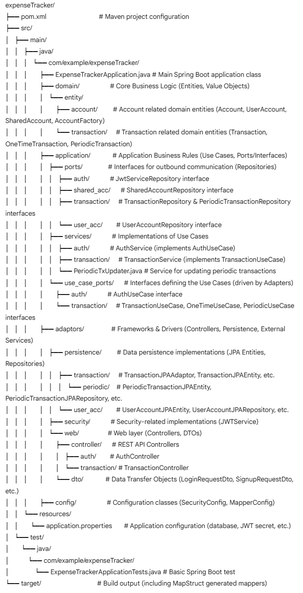

# Expense Tracker Application

## 🚀 Project Overview

The Expense Tracker is a Spring Boot application designed to help users manage their finances. It allows users to track one-time and recurring income and expenses, manage user accounts, and view transaction histories. The project is built with a focus on Clean Architecture and SOLID principles to ensure maintainability, scalability, and testability.

---

## 🛠️ Technologies Used

* **Java**: Version 21
* **Spring Boot**: Version 3.4.5
    * Spring Data JPA: For database interaction.
    * Spring Web: For creating RESTful APIs.
    * Spring Security: For authentication and authorization.
    * Spring Boot DevTools: For rapid application development.
    * Spring Boot Starter Test: For testing.
    * Spring Boot Starter Validation: For request DTO validation.
* **Maven**: Dependency management and build tool.
* **MySQL**: Relational database (Connector/J used).
* **Lombok**: To reduce boilerplate code (e.g., getters, setters).
* **MapStruct**: For bean mapping (e.g., DTO to Entity). Version 1.5.3.Final.
* **JWT (Java Web Token - io.jsonwebtoken)**: For stateless authentication. Version 0.12.3.
* **Hibernate**: JPA implementation.
* **JUnit Jupiter**: For testing.

---

## 🏗️ Project Structure (Clean Architecture)

This project adheres to the principles of Clean Architecture, which promotes a separation of concerns by organizing the code into distinct layers. This makes the system easier to understand, test, and maintain.



### Layers Explained:

1.  **Domain Layer (`domain/entity`)**:
    * **Purpose**: Contains the core business logic and enterprise-wide entities. This layer is the heart of the application and has no dependencies on other layers.
    * **Contents**:
        * Entities: Plain Java objects representing core concepts like `Account`, `Transaction`, `UserAccount`, `PeriodicTransaction`.
        * Value Objects: (e.g., `Transaction.Txtype`).
        * Domain Services: (Not explicitly separated in current structure, logic might be within entities or application services).
    * **Key Rule**: This layer depends on nothing.

2.  **Application Layer (`application/ports`, `application/services`, `application/use_case_ports`)**:
    * **Purpose**: Orchestrates the data flow and implements the application-specific business rules (use cases). It defines interfaces (ports) for external dependencies like databases or web services.
    * **Contents**:
        * `use_case_ports`: Interfaces defining the operations for business use cases (e.g., `AuthUseCase`, `TransactionUseCase`). These are implemented by the services.
        * `services`: Concrete implementations of the use case interfaces (e.g., `AuthService`, `TransactionService`). They contain the logic to fulfill a use case, coordinating domain entities and using repository ports.
        * `ports`: Interfaces (ports) that define contracts for outer layers, particularly for data persistence (e.g., `UserAccountRepository`, `TransactionRepository`). These are implemented by adapters.
    * **Key Rule**: Depends only on the Domain layer.

3.  **Adapters Layer (`adaptors`)**:
    * **Purpose**: Connects the application to the outside world. It implements the ports defined in the Application layer and handles framework-specific concerns.
    * **Contents**:
        * `web` (`adaptors/web`): Handles HTTP requests.
            * `controller`: REST controllers (e.g., `AuthController`, `TransactionController`) that receive requests, call application services (use cases), and return responses.
            * `dto`: Data Transfer Objects (e.g., `SignupRequestDto`, `OneTimeRequestDto`) used for transferring data between the web layer and the application layer.
        * `persistence` (`adaptors/persistence`): Handles data storage and retrieval.
            * JPA Entities: (e.g., `UserAccountJPAEntity`, `TransactionJPAEntity`) that map to database tables.
            * Spring Data JPA Repositories: (e.g., `SpringDataUserRepo` in `UserAccountJPARepository.java`) for basic CRUD operations.
            * Repository Implementations: Concrete implementations of the repository ports defined in the Application layer (e.g., `UserAccountJPARepository`, `TransactionJPAAdaptor`). These use JPA entities and Spring Data repositories.
            * Mappers: MapStruct mappers (e.g., `UserMapper`, `TxMapper`, `PeriodicTxMapper`) convert between domain entities and persistence (JPA) entities. Generated mappers are in `target/generated-sources/annotations/`.
        * `security` (`adaptors/security`): Handles security concerns.
            * `JwtService`: Implements `JwtServiceRepository` for generating and validating JWTs.
    * **Key Rule**: Depends on the Application layer (by implementing its ports and calling its use cases).

### Dependency Rule:

The golden rule of Clean Architecture is the **Dependency Rule**: *source code dependencies can only point inwards*. Nothing in an inner layer can know anything at all about something in an outer layer. Specifically, code in the Domain and Application layers must not depend on any code in the Adapters layer.

---

## ✨ SOLID Principles in Practice

SOLID principles are a set of five design principles intended to make software designs more understandable, flexible, and maintainable.

* **Single Responsibility Principle (SRP)**: Each class or module should have one, and only one, reason to change.
    * *Example*: `TransactionService` is responsible for transaction-related use cases, while `AuthService` handles authentication. Mappers like `UserMapper` are solely for object conversion.
* **Open/Closed Principle (OCP)**: Software entities (classes, modules, functions, etc.) should be open for extension, but closed for modification.
    * *Example*: Use case interfaces (`TransactionUseCase`) allow for different implementations or additional features without modifying the core interface. New transaction types or account types can be added by extending base classes (`Transaction`, `Account`) or implementing common interfaces.
* **Liskov Substitution Principle (LSP)**: Subtypes must be substitutable for their base types.
    * *Example*: `OneTimeTransaction` and `PeriodicTransaction` are subtypes of `Transaction`. They should be usable wherever a `Transaction` is expected, for common properties and methods.
* **Interface Segregation Principle (ISP)**: Clients should not be forced to depend upon interfaces they do not use.
    * *Example*: Specific use case interfaces like `AuthUseCase` and `TransactionUseCase` provide focused contracts rather than one large "AppService" interface. Repository interfaces (`UserAccountRepository`, `TransactionRepository`) are also specific to the entity they manage.
* **Dependency Inversion Principle (DIP)**: High-level modules should not depend on low-level modules. Both should depend on abstractions. Abstractions should not depend on details. Details should depend on abstractions.
    * *Example*: Application services (high-level) like `TransactionService` depend on repository interfaces (`TransactionRepository`, `PeriodicTransactionRepository`) (abstractions), not on their concrete JPA implementations (low-level) in the `adaptors.persistence` package. The persistence adapters implement these interfaces.

---

## 🔑 Key Concepts

* **Entities (`domain/entity`)**: Core business objects (e.g., `Account`, `Transaction`). They encapsulate the most general and high-level rules.
* **Use Cases (`application/use_case_ports`, `application/services`)**: Represent specific interactions a user can have with the system (e.g., "add a one-time transaction", "user login").
* **Repositories (Ports & Adapters)**: Ports (`application/ports`) define contracts for data access. Adapters (`adaptors/persistence`) implement these contracts using specific technologies like JPA.
* **DTOs (`adaptors/web/dto`)**: Simple objects used to transfer data between layers, especially between the controller and application services (e.g., `LoginRequestDto`, `OneTimeRequestDto`).
* **Mappers (`adaptors/persistence/*Mapper.java`, generated in `target/`)**: Used by MapStruct to convert between different object types (e.g., Domain Entities to JPA Entities, DTOs to Domain Entities). Example: `UserMapperImpl`, `TxMapperImpl`.
* **Configuration (`config/`)**:
    * `SecurityConfig.java`: Configures Spring Security, including password encoding and HTTP security rules.
    * `application.properties`: Contains settings for database connection, server port, and JWT secrets.

---

## ⚙️ Setup and Running the Project

### Prerequisites

* **Java Development Kit (JDK)**: Version 21 or higher.
* **Apache Maven**: For building the project and managing dependencies.
* **MySQL Server**: Running and accessible.

### Database Setup

1.  Ensure MySQL server is running.
2.  Create a database named `expense_tracker`.
3.  The application uses the following credentials by default (from `src/main/resources/application.properties`):
    * URL: `jdbc:mysql://localhost:3306/expense_tracker`
    * Username: `user1`
    * Password: `ExpenseTracker1!`
      You can modify these in `application.properties` if your MySQL setup differs.
4.  Hibernate is configured with `spring.jpa.hibernate.ddl-auto=update`, which means it will attempt to update the schema based on your JPA entities. For a fresh setup, it should create the necessary tables. For production, consider using a migration tool like Flyway or Liquibase.

### Build and Run

1.  **Clone the repository:**
    ```bash
    git clone <your-repository-url>
    cd expenseTracker
    ```
2.  **Build the project using Maven:**
    ```bash
    mvn clean install
    ```
    This will compile the code, run tests, and build the JAR file in the `target/` directory. It will also generate MapStruct mappers.
3.  **Run the application:**
    ```bash
    java -jar target/expenseTracker-0.0.1-SNAPSHOT.jar
    ```
    Alternatively, you can run it from your IDE by running the `main` method in `ExpenseTrackerApplication.java`.

The application will start, typically on port `8080` (configurable in `application.properties`).

---

## 🌐 API Endpoints

The application exposes RESTful APIs for various functionalities. Key controllers include:

* **AuthController (`/api/auth`)**:
    * `POST /signup`: User registration.
    * `POST /login`: User login.
* **TransactionController (`/api/transactions`)**:
    * `POST /one-time`: Add a one-time transaction.
    * `POST /periodic`: Schedule a periodic transaction.
    * `GET /{accountId}`: List transactions for an account within a date range.

Refer to the controller classes for detailed request/response formats and parameters.

---

## 💡 Adding New Business Logic (Step-by-Step Guide)

This guide will walk you through adding a new feature, for example, **"Allowing users to set and track financial goals for their accounts."**

### Step 1: Define the Domain Entity

This is the core of your new feature.

1.  **Location**: `src/main/java/com/example/expenseTracker/domain/entity/`
2.  **Action**: Create a new package, e.g., `goal`. Inside it, create your entity class.
    ```java
    // src/main/java/com/example/expenseTracker/domain/entity/goal/FinancialGoal.java
    package com.example.expenseTracker.domain.entity.goal;

    import lombok.Getter;
    import lombok.Setter;
    import java.math.BigDecimal;
    import java.time.Instant;

    @Getter
    @Setter
    public class FinancialGoal {
        private Long id;
        private Long accountId; // Link to UserAccount
        private String goalName;
        private String description;
        private BigDecimal targetAmount;
        private BigDecimal currentAmount;
        private Instant createdAt;
        private Instant deadline;
        private boolean achieved;

        public FinancialGoal(Long accountId, String goalName, String description, BigDecimal targetAmount, Instant deadline) {
            this.accountId = accountId;
            this.goalName = goalName;
            this.description = description;
            this.targetAmount = targetAmount;
            this.currentAmount = BigDecimal.ZERO;
            this.createdAt = Instant.now();
            this.deadline = deadline;
            this.achieved = false;
        }

        // Business logic methods, e.g., updateProgress, checkAchieved
        public void updateProgress(BigDecimal amountContributed) {
            this.currentAmount = this.currentAmount.add(amountContributed);
            if (this.currentAmount.compareTo(this.targetAmount) >= 0) {
                this.achieved = true;
            }
        }
    }
    ```

### Step 2: Define Application Layer Ports (Interfaces)

#### A. Repository Port (Interface)

If your new entity needs to be persisted:

1.  **Location**: `src/main/java/com/example/expenseTracker/application/ports/`
2.  **Action**: Create a new package, e.g., `goal`. Inside it, define the repository interface.
    ```java
    // src/main/java/com/example/expenseTracker/application/ports/goal/FinancialGoalRepository.java
    package com.example.expenseTracker.application.ports.goal;

    import com.example.expenseTracker.domain.entity.goal.FinancialGoal;
    import java.util.List;
    import java.util.Optional;

    public interface FinancialGoalRepository {
        FinancialGoal save(FinancialGoal goal);
        Optional<FinancialGoal> findById(Long id);
        List<FinancialGoal> findByAccountId(Long accountId);
        void deleteById(Long id);
    }
    ```

#### B. Use Case Port (Interface)

Defines the operations for this new business logic.

1.  **Location**: `src/main/java/com/example/expenseTracker/application/use_case_ports/`
2.  **Action**: Create a new package, e.g., `goal`. Inside it, define the use case interface.
    *You'll need DTOs for requests/responses, define them in Step 5A first or placeholder them for now.*
    ```java
    // src/main/java/com/example/expenseTracker/application/use_case_ports/goal/FinancialGoalUseCase.java
    package com.example.expenseTracker.application.use_case_ports.goal;

    // Assume DTOs like AddFinancialGoalRequestDto, FinancialGoalViewDto, UpdateGoalProgressDto exist or will be created
    import com.example.expenseTracker.adaptors.web.dto.goal.AddFinancialGoalRequestDto; // Placeholder
    import com.example.expenseTracker.adaptors.web.dto.goal.FinancialGoalViewDto;     // Placeholder
    import com.example.expenseTracker.adaptors.web.dto.goal.UpdateGoalProgressDto;  // Placeholder

    import java.util.List;

    public interface FinancialGoalUseCase {
        FinancialGoalViewDto addFinancialGoal(AddFinancialGoalRequestDto dto);
        List<FinancialGoalViewDto> getFinancialGoalsByAccountId(Long accountId);
        FinancialGoalViewDto getFinancialGoalById(Long goalId);
        FinancialGoalViewDto updateFinancialGoalProgress(Long goalId, UpdateGoalProgressDto dto);
        void deleteFinancialGoal(Long goalId);
    }
    ```

### Step 3: Implement Application Layer Services (Use Cases)

This is where the core application logic for the feature resides.

1.  **Location**: `src/main/java/com/example/expenseTracker/application/services/`
2.  **Action**: Create a new package, e.g., `goal`. Inside it, implement the use case interface.
    ```java
    // src/main/java/com/example/expenseTracker/application/services/goal/FinancialGoalService.java
    package com.example.expenseTracker.application.services.goal;

    import com.example.expenseTracker.application.ports.goal.FinancialGoalRepository;
    import com.example.expenseTracker.application.ports.user_acc.UserAccountRepository; // If you need to validate account
    import com.example.expenseTracker.application.use_case_ports.goal.FinancialGoalUseCase;
    import com.example.expenseTracker.domain.entity.goal.FinancialGoal;
    // Import your DTOs once created
    import com.example.expenseTracker.adaptors.web.dto.goal.AddFinancialGoalRequestDto;
    import com.example.expenseTracker.adaptors.web.dto.goal.FinancialGoalViewDto;
    import com.example.expenseTracker.adaptors.web.dto.goal.UpdateGoalProgressDto;

    import lombok.RequiredArgsConstructor;
    import org.springframework.stereotype.Service;
    import org.springframework.transaction.annotation.Transactional;

    import java.util.List;
    import java.util.stream.Collectors;

    @Service
    @RequiredArgsConstructor
    @Transactional
    public class FinancialGoalService implements FinancialGoalUseCase {

        private final FinancialGoalRepository financialGoalRepository;
        private final UserAccountRepository userAccountRepository; // Example dependency

        // You'll also need a mapper for Domain to ViewDTO
        // private final FinancialGoalDtoMapper dtoMapper; // Assume this exists

        @Override
        public FinancialGoalViewDto addFinancialGoal(AddFinancialGoalRequestDto dto) {
            userAccountRepository.findById(dto.getAccountId())
                    .orElseThrow(() -> new IllegalArgumentException("Account not found"));

            FinancialGoal goal = new FinancialGoal(
                    dto.getAccountId(),
                    dto.getGoalName(),
                    dto.getDescription(),
                    dto.getTargetAmount(),
                    dto.getDeadline()
            );
            FinancialGoal savedGoal = financialGoalRepository.save(goal);
            return convertToViewDto(savedGoal); // Implement this conversion
        }

        @Override
        public List<FinancialGoalViewDto> getFinancialGoalsByAccountId(Long accountId) {
            userAccountRepository.findById(accountId)
                    .orElseThrow(() -> new IllegalArgumentException("Account not found"));
            return financialGoalRepository.findByAccountId(accountId)
                    .stream()
                    .map(this::convertToViewDto)
                    .collect(Collectors.toList());
        }

        @Override
        public FinancialGoalViewDto getFinancialGoalById(Long goalId) {
            FinancialGoal goal = financialGoalRepository.findById(goalId)
                 .orElseThrow(() -> new IllegalArgumentException("Goal not found"));
            return convertToViewDto(goal);
        }

        @Override
        public FinancialGoalViewDto updateFinancialGoalProgress(Long goalId, UpdateGoalProgressDto dto) {
            FinancialGoal goal = financialGoalRepository.findById(goalId)
                 .orElseThrow(() -> new IllegalArgumentException("Goal not found"));
            // Ensure the current user has rights to update this goal (e.g. check accountId)
            goal.updateProgress(dto.getAmountContributed());
            FinancialGoal updatedGoal = financialGoalRepository.save(goal);
            return convertToViewDto(updatedGoal);
        }

        @Override
        public void deleteFinancialGoal(Long goalId) {
             FinancialGoal goal = financialGoalRepository.findById(goalId)
                 .orElseThrow(() -> new IllegalArgumentException("Goal not found"));
            // Add authorization checks if needed
            financialGoalRepository.deleteById(goalId);
        }

        // Temporary/Example DTO conversion - ideally use a MapStruct mapper
        private FinancialGoalViewDto convertToViewDto(FinancialGoal goal) {
            if (goal == null) return null;
            FinancialGoalViewDto dto = new FinancialGoalViewDto();
            dto.setId(goal.getId());
            dto.setAccountId(goal.getAccountId());
            dto.setGoalName(goal.getGoalName());
            dto.setDescription(goal.getDescription());
            dto.setTargetAmount(goal.getTargetAmount());
            dto.setCurrentAmount(goal.getCurrentAmount());
            dto.setCreatedAt(goal.getCreatedAt());
            dto.setDeadline(goal.getDeadline());
            dto.setAchieved(goal.isAchieved());
            return dto;
        }
    }
    ```

### Step 4: Implement Adapter Layer - Persistence

This layer will handle how `FinancialGoal` objects are stored and retrieved.

#### A. JPA Entity

1.  **Location**: `src/main/java/com/example/expenseTracker/adaptors/persistence/`
2.  **Action**: Create a new package, e.g., `goal`. Define the JPA entity.
    ```java
    // src/main/java/com/example/expenseTracker/adaptors/persistence/goal/FinancialGoalJPAEntity.java
    package com.example.expenseTracker.adaptors.persistence.goal;

    import jakarta.persistence.*;
    import lombok.Getter;
    import lombok.Setter;
    import java.math.BigDecimal;
    import java.time.Instant;

    @Entity
    @Table(name = "financial_goals")
    @Getter
    @Setter
    public class FinancialGoalJPAEntity {
        @Id
        @GeneratedValue(strategy = GenerationType.IDENTITY)
        private Long id;

        @Column(nullable = false)
        private Long accountId;

        @Column(nullable = false)
        private String goalName;

        private String description;

        @Column(nullable = false, precision = 19, scale = 2)
        private BigDecimal targetAmount;

        @Column(precision = 19, scale = 2)
        private BigDecimal currentAmount;

        @Column(nullable = false)
        private Instant createdAt;

        private Instant deadline;
        private boolean achieved;
    }
    ```

#### B. Mapper (Domain Entity <-> JPA Entity)

Use MapStruct for this.

1.  **Location**: `src/main/java/com/example/expenseTracker/adaptors/persistence/goal/` (same package as JPA Entity and Repository Adapter).
2.  **Action**: Define the MapStruct interface.
    ```java
    // src/main/java/com/example/expenseTracker/adaptors/persistence/goal/FinancialGoalPersistenceMapper.java
    package com.example.expenseTracker.adaptors.persistence.goal;

    import com.example.expenseTracker.domain.entity.goal.FinancialGoal;
    import org.mapstruct.Mapper;
    import org.mapstruct.MappingConstants;

    @Mapper(componentModel = MappingConstants.ComponentModel.SPRING)
    public interface FinancialGoalPersistenceMapper {
        FinancialGoal toDomain(FinancialGoalJPAEntity entity);
        FinancialGoalJPAEntity toJpa(FinancialGoal domain);
    }
    ```
    MapStruct will generate the implementation in the `target/generated-sources/annotations/` directory during compilation.

#### C. Spring Data JPA Repository (Interface)

1.  **Location**: `src/main/java/com/example/expenseTracker/adaptors/persistence/goal/`
2.  **Action**: Define the Spring Data JPA interface.
    ```java
    // src/main/java/com/example/expenseTracker/adaptors/persistence/goal/SpringDataFinancialGoalRepo.java
    package com.example.expenseTracker.adaptors.persistence.goal;

    import org.springframework.data.jpa.repository.JpaRepository;
    import java.util.List;

    public interface SpringDataFinancialGoalRepo extends JpaRepository<FinancialGoalJPAEntity, Long> {
        List<FinancialGoalJPAEntity> findByAccountId(Long accountId);
    }
    ```

#### D. Repository Implementation (Adapter)

This class implements the `FinancialGoalRepository` port from the Application layer.

1.  **Location**: `src/main/java/com/example/expenseTracker/adaptors/persistence/goal/`
2.  **Action**: Create the adapter class.
    ```java
    // src/main/java/com/example/expenseTracker/adaptors/persistence/goal/FinancialGoalJPARepository.java
    package com.example.expenseTracker.adaptors.persistence.goal;

    import com.example.expenseTracker.application.ports.goal.FinancialGoalRepository;
    import com.example.expenseTracker.domain.entity.goal.FinancialGoal;
    import lombok.RequiredArgsConstructor;
    import org.springframework.stereotype.Repository;

    import java.util.List;
    import java.util.Optional;
    import java.util.stream.Collectors;

    @Repository
    @RequiredArgsConstructor
    public class FinancialGoalJPARepository implements FinancialGoalRepository {

        private final SpringDataFinancialGoalRepo jpaRepo;
        private final FinancialGoalPersistenceMapper mapper;

        @Override
        public FinancialGoal save(FinancialGoal goal) {
            FinancialGoalJPAEntity entity = mapper.toJpa(goal);
            FinancialGoalJPAEntity savedEntity = jpaRepo.save(entity);
            return mapper.toDomain(savedEntity);
        }

        @Override
        public Optional<FinancialGoal> findById(Long id) {
            return jpaRepo.findById(id).map(mapper::toDomain);
        }

        @Override
        public List<FinancialGoal> findByAccountId(Long accountId) {
            return jpaRepo.findByAccountId(accountId)
                    .stream()
                    .map(mapper::toDomain)
                    .collect(Collectors.toList());
        }

        @Override
        public void deleteById(Long id) {
            jpaRepo.deleteById(id);
        }
    }
    ```

### Step 5: Implement Adapter Layer - Web (Controller & DTOs)

This layer exposes your new feature via API endpoints.

#### A. DTOs (Data Transfer Objects)

1.  **Location**: `src/main/java/com/example/expenseTracker/adaptors/web/dto/`
2.  **Action**: Create a new package, e.g., `goal`. Define DTOs for requests and responses.
    ```java
    // src/main/java/com/example/expenseTracker/adaptors/web/dto/goal/AddFinancialGoalRequestDto.java
    package com.example.expenseTracker.adaptors.web.dto.goal;

    import jakarta.validation.constraints.DecimalMin;
    import jakarta.validation.constraints.FutureOrPresent;
    import jakarta.validation.constraints.NotBlank;
    import jakarta.validation.constraints.NotNull;
    import lombok.Getter;
    import lombok.Setter;
    import java.math.BigDecimal;
    import java.time.Instant;

    @Getter
    @Setter
    public class AddFinancialGoalRequestDto {
        @NotNull
        private Long accountId;
        @NotBlank
        private String goalName;
        private String description;
        @NotNull
        @DecimalMin(value = "0.01")
        private BigDecimal targetAmount;
        @FutureOrPresent
        private Instant deadline;
    }

    // src/main/java/com/example/expenseTracker/adaptors/web/dto/goal/FinancialGoalViewDto.java
    package com.example.expenseTracker.adaptors.web.dto.goal;

    import lombok.Getter;
    import lombok.Setter;
    import java.math.BigDecimal;
    import java.time.Instant;

    @Getter
    @Setter
    public class FinancialGoalViewDto {
        private Long id;
        private Long accountId;
        private String goalName;
        private String description;
        private BigDecimal targetAmount;
        private BigDecimal currentAmount;
        private Instant createdAt;
        private Instant deadline;
        private boolean achieved;
    }

    // src/main/java/com/example/expenseTracker/adaptors/web/dto/goal/UpdateGoalProgressDto.java
    package com.example.expenseTracker.adaptors.web.dto.goal;

    import jakarta.validation.constraints.DecimalMin;
    import jakarta.validation.constraints.NotNull;
    import lombok.Getter;
    import lombok.Setter;
    import java.math.BigDecimal;

    @Getter
    @Setter
    public class UpdateGoalProgressDto {
        @NotNull
        @DecimalMin(value = "0.01") // Assuming contribution must be positive
        private BigDecimal amountContributed;
    }
    ```
    *Optionally, create a MapStruct mapper for Domain Entity to ViewDTO conversion if not handled in the service layer.*

#### B. Controller

1.  **Location**: `src/main/java/com/example/expenseTracker/adaptors/web/controller/`
2.  **Action**: Create a new package, e.g., `goal`. Define the REST controller.
    ```java
    // src/main/java/com/example/expenseTracker/adaptors/web/controller/goal/FinancialGoalController.java
    package com.example.expenseTracker.adaptors.web.controller.goal;

    import com.example.expenseTracker.application.use_case_ports.goal.FinancialGoalUseCase;
    import com.example.expenseTracker.adaptors.web.dto.goal.AddFinancialGoalRequestDto;
    import com.example.expenseTracker.adaptors.web.dto.goal.FinancialGoalViewDto;
    import com.example.expenseTracker.adaptors.web.dto.goal.UpdateGoalProgressDto;
    import jakarta.validation.Valid;
    import lombok.RequiredArgsConstructor;
    import org.springframework.http.HttpStatus;
    import org.springframework.http.ResponseEntity;
    import org.springframework.web.bind.annotation.*;

    import java.util.List;

    @RestController
    @RequestMapping("/api/goals")
    @RequiredArgsConstructor
    public class FinancialGoalController {

        private final FinancialGoalUseCase financialGoalUseCase;

        @PostMapping
        public ResponseEntity<FinancialGoalViewDto> addFinancialGoal(@Valid @RequestBody AddFinancialGoalRequestDto dto) {
            FinancialGoalViewDto createdGoal = financialGoalUseCase.addFinancialGoal(dto);
            return new ResponseEntity<>(createdGoal, HttpStatus.CREATED);
        }

        @GetMapping("/account/{accountId}")
        public ResponseEntity<List<FinancialGoalViewDto>> getFinancialGoalsByAccountId(@PathVariable Long accountId) {
            List<FinancialGoalViewDto> goals = financialGoalUseCase.getFinancialGoalsByAccountId(accountId);
            return ResponseEntity.ok(goals);
        }

        @GetMapping("/{goalId}")
        public ResponseEntity<FinancialGoalViewDto> getFinancialGoalById(@PathVariable Long goalId) {
            FinancialGoalViewDto goal = financialGoalUseCase.getFinancialGoalById(goalId);
            return ResponseEntity.ok(goal);
        }

        @PutMapping("/{goalId}/progress")
        public ResponseEntity<FinancialGoalViewDto> updateFinancialGoalProgress(
                @PathVariable Long goalId,
                @Valid @RequestBody UpdateGoalProgressDto dto) {
            FinancialGoalViewDto updatedGoal = financialGoalUseCase.updateFinancialGoalProgress(goalId, dto);
            return ResponseEntity.ok(updatedGoal);
        }

        @DeleteMapping("/{goalId}")
        public ResponseEntity<Void> deleteFinancialGoal(@PathVariable Long goalId) {
            // Add security checks here to ensure the user is authorized to delete this goal.
            financialGoalUseCase.deleteFinancialGoal(goalId);
            return ResponseEntity.noContent().build();
        }
    }
    ```

### Step 6: Configuration (if needed)

* **Security**: If your new endpoints require specific authentication or authorization rules beyond the defaults, update `SecurityConfig.java`. For example, you might want to ensure that a user can only manage goals linked to their own account.
    ```java
    // In SecurityConfig.java, within the .authorizeHttpRequests() lambda
    // .requestMatchers("/api/goals/**").authenticated() // Or more specific rules
    ```
* **Beans**: If your new feature introduces components that need to be managed by Spring and aren't automatically discovered (e.g., complex configurations), define them in a `@Configuration` class.

### Step 7: Testing

Thoroughly test your new feature:

* **Domain Layer**: Unit test any business logic within your `FinancialGoal` entity.
* **Application Layer**: Unit test your `FinancialGoalService`. Mock its dependencies (like `FinancialGoalRepository`).
* **Adapter Layer**:
    * **Persistence**: Write integration tests for `FinancialGoalJPARepository` to ensure it correctly interacts with the database. Use an in-memory database (like H2) or a test-scoped real database for these tests. Test your MapStruct mappers.
    * **Web**: Write integration tests for `FinancialGoalController` using `@SpringBootTest` and `MockMvc` to verify API behavior, request validation, and responses.
* **Location**: Create corresponding test packages under `src/test/java/com/example/expenseTracker/`.

By following these steps, you can integrate new features into the `expenseTracker` application while maintaining its Clean Architecture and adhering to SOLID principles. This structured approach helps manage complexity and ensures the application remains robust and maintainable.

---

This README should serve as a good starting point. Remember to keep it updated as the project evolves!